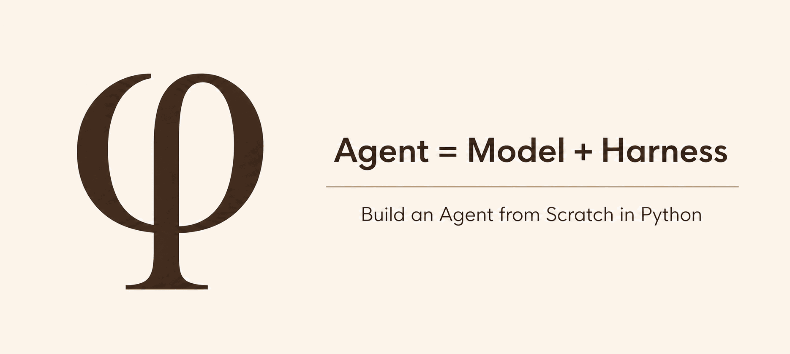

<div align="center">
  

  <h1>Phi</h1>

  <p><strong>An inspectable Agent Harness, built from scratch in Python.</strong></p>

  <p>
    <a href="https://www.python.org/"></a>
    <a href="https://docs.astral.sh/uv/"></a>
    <a href="https://typer.tiangolo.com/"></a>
    <a href="https://textual.textualize.io/"></a>
    <a href="./LICENSE"></a>
  </p>
</div>

Phi is an engineering-quality Python reference implementation of an Agent Harness. It keeps the
control loop, tool execution, context construction, session lifecycle, and safety boundaries
explicit—so every part of an agent can be understood, tested, and extended.

“From scratch” means implementing the Harness itself, not training a language model or delegating
the core loop to an agent framework.

## The idea

Phi starts from one definition:

<p align="center"><strong>Agent = Model + Harness</strong></p>

The Model is a stateless protocol boundary that proposes responses and actions. The Harness owns
the bounded loop: it builds Context, governs tools, observes the Environment, manages failures, and
decides when a Run stops.

| Boundary | Responsibility |
| --- | --- |
| **Model** | Normalize OpenAI-compatible requests, responses, streaming, and tool calls |
| **Harness** | Control Runs, Steps, tools, Events, Hooks, failures, and stopping decisions |
| **Environment** | Provide observable ground truth through files, processes, tests, and services |
| **Hosts** | Expose the same runtime through a Typer CLI and a Textual TUI |

## Core capabilities

Phi's v1 design brings the complete agent runtime together through a set of explicit, composable
capabilities:

- **Model gateway** — OpenAI-compatible HTTP and SSE transport, normalized response types, and a
  deterministic Scripted Model for offline tests.
- **Tools and safety** — schema-driven tools, validation, approvals, timeouts, execution policy,
  and honest workspace-confinement boundaries.
- **Harness loop** — bounded, cancellable Runs with streaming Events, behavioral Hooks, and typed
  completion and failure semantics.
- **Sessions and Context** — durable conversation trees, resume and fork workflows, budgeted
  Context construction, and compaction without deleting history.
- **Runtime integrations** — cwd-scoped project instructions, on-demand Agent Skills, and managed
  stdio MCP tools, resources, and user-selected prompts.
- **Delegation** — isolated Subagent Sessions built from the same Run, Tool, Event, and Hook
  primitives as the parent Agent.
- **Developer experience** — a headless CLI and interactive TUI backed by the same application
  services rather than separate implementations.

The Model gateway, Tool processing boundary, Harness core, Session/Context services, cwd-scoped
runtime integrations, and Delegation-style Subagents are implemented today. Phi loads root
`AGENTS.md` instructions with a `CLAUDE.md` fallback, discovers validated global and project Skills,
assembles a stable Context prefix, and registers a read-only `skill_tool` through the existing Tool
Registry and Dispatcher. Model-disabled Skills remain available through a separate trusted
user-invocation API without being advertised to the Model.

Phi also discovers Agent Definitions from `~/.phi/agents/` and `.phi/agents/`, with project
definitions taking precedence. A parent Agent can use `spawn_agent`, `check_agent`, `steer_agent`,
`list_agents`, and `close_agent` to coordinate isolated child Sessions through the same Harness,
Tool, Hook, Event, and Trace boundaries. Definitions may restrict Tools and prefer a Model;
spawn-time selection takes precedence, while child authority can never exceed the invoking Agent's
Tool Registry. Delegation is bounded to depth three and four concurrently running Subagents per
cwd-scoped runtime. Unfinished descendants are cancelled and awaited before an owning Run or
runtime lifetime ends.

Phi also loads stdio MCP servers from `~/.phi/mcp.json` and `.phi/mcp.json`. Project definitions
replace global definitions with the same server ID, including `"enabled": false` definitions that
disable a global server for one project:

```json
{
  "mcpServers": {
    "local": {
      "command": "uvx",
      "args": ["example-mcp-server"],
      "env": {},
      "enabled": true
    }
  }
}
```

Enabled servers start in the canonical project cwd and are reused until an explicit rebuild or cwd
change. Their Tools are registered as `mcp__{server_id}__{tool_name}` and remain unconfined, so the
existing Approval Policy gates them. Concrete Resources are available through the read-only
`mcp_list_resources` and `mcp_read_resource` meta-tools; these protocol reads do not claim
workspace Confinement. Prompts stay outside the Model-visible Tool Registry and are returned only
through trusted runtime operations such as `/mcp__{server_id}__{prompt_name}` selection. One broken
server produces an Event and diagnostic without blocking healthy servers, and runtime shutdown
owns all MCP client sessions and subprocesses.

Phi persists versioned conversation trees with crash-aware commits, exact forks, branch navigation,
and separate redacted Event Traces. Context construction is immutable and inspectable, uses
deterministic request estimates plus runtime provider-Usage anchors, and supports manual, threshold,
and bounded overflow compaction without deleting history. The public Harness operation runs every
ordinary Step through the streaming Model protocol, processes complete Tool Calls sequentially,
emits ordered lifecycle Events, applies behavioral Hooks, and returns a bounded immutable Run
Result.

`read`, `write`, `edit`, `grep`, `find`, and `ls` route file access through a FileSystem that
canonically resolves paths, confines them to an explicit workspace root, and denies protected Git
metadata and dotenv paths by default. `bash` is deliberately different: it starts in the workspace
and is governed by approval and timeout, but it is unconfined and is not an operating-system
sandbox. File Confinement is an in-process structural check, not protection against every
filesystem race. The CLI and TUI remain a minimal shell while the Host roadmap stage is built; the
Model, Tool, Harness, Session, Context, and cwd runtime services are not yet wired into an
interactive Host workflow.

## Design principles

- Keep the Model stateless and the Hosts thin.
- Make control flow, authority, and failure policy visible in ordinary Python.
- Default to deterministic, offline tests and evaluate outcomes against Environment state.
- Fail closed when approval, confinement, or execution state is uncertain.
- Add abstractions when their first working capability arrives.

## Project guide

- [Architecture](docs/architecture.md) — system layers, dependency direction, and target package map
- [System design](docs/README.md) — the detailed contract for each capability
- [Roadmap](docs/roadmap.md) — v1 scope, implementation sequence, and completion criteria
- [Project glossary](CONTEXT.md) — the canonical language used across Phi
- [Course site prototype](docs/course/index.md) — an early teaching surface derived from the design

> This README will evolve alongside Phi as the project is developed.
